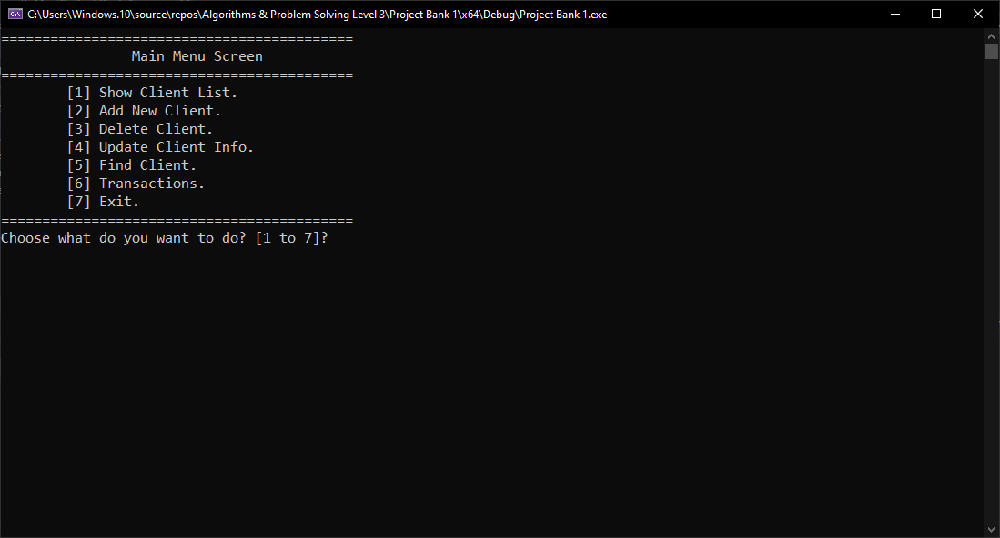
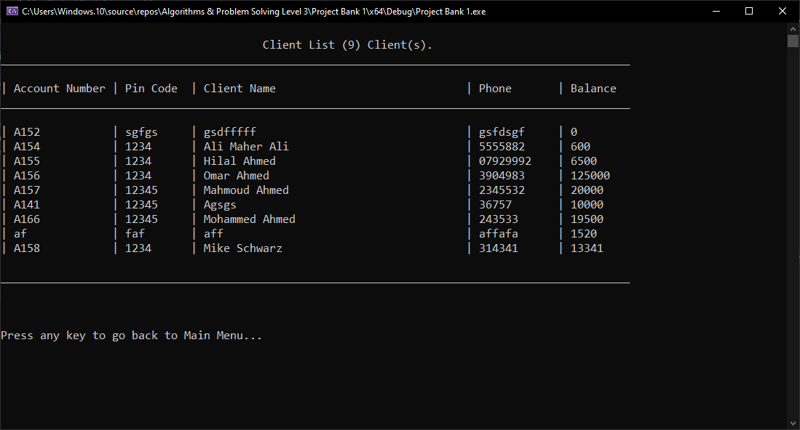
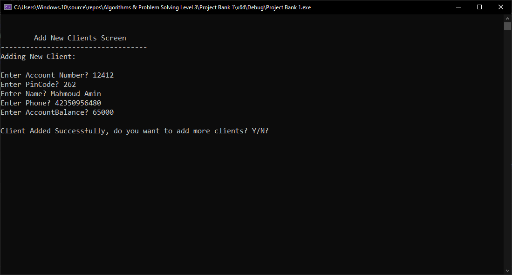
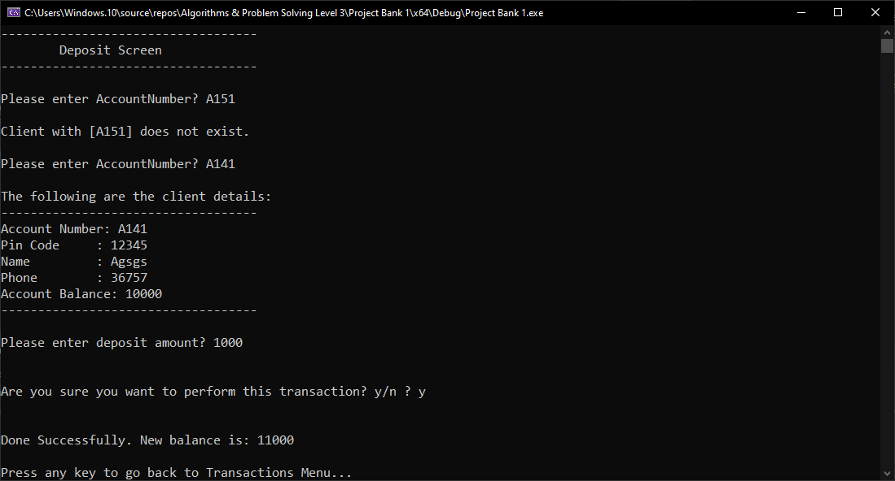
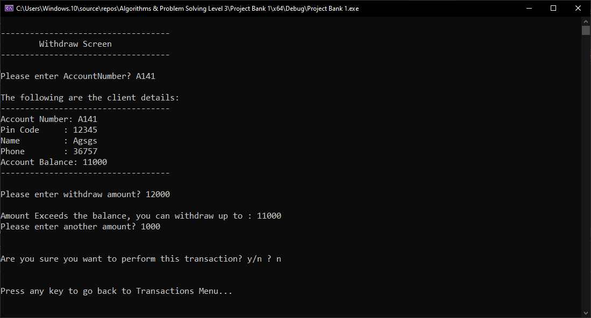
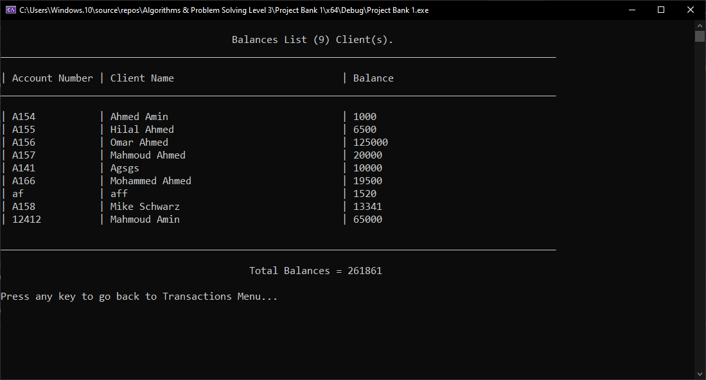

# Client Management System

A console-based C++ application for managing bank clients: add, delete, update,
find, and list clients, plus basic deposit/withdraw transactions and a total
balances report.

This is a learning project built as an extension of a course exercise on
file handling, structs, and basic CRUD operations in C++. It's meant to
demonstrate those concepts, not to be a production banking system.

## Features

- Add, update, delete, and search for clients by account number
- List all clients in a formatted table
- Deposit and withdraw funds, with balance validation on withdrawals
- View total balances across all clients
- Basic input validation on numeric fields and menu choices

## How data is stored

Client records are stored in a local text file (`Clients.txt`), one record
per line, with fields separated by a custom delimiter (`#//#`). There is no
database — the whole system reads and writes this file directly.

## Screenshots

**Main Menu**

**Client List**

**Adding a New Client**

**Deposit Flow (Account Lookup + Transaction)**

**Withdraw with Balance Validation**

**Total Balances Report**

## Known limitations

- No encryption or security around PIN codes or balances — this is a
  console exercise, not a production system
- The delimiter-based file format (`#//#`) would break if a field ever
  contained that exact sequence
- Menu navigation uses recursive function calls rather than a loop

## Build

Open `Project Bank 1.sln` in Visual Studio and build/run, or compile
`Project Bank 1.cpp` directly with any C++11-compatible compiler.
