# Client & Transactions Management System

A console-based C++ application for managing bank clients: add, delete, update,
find, and list clients; deposit/withdraw transactions with a total balances
report; and user accounts with permission-based access control behind a login
screen.

This is a learning project built as an extension of a course exercise on
file handling, structs, and basic CRUD operations in C++. It's meant to
demonstrate those concepts, not to be a production banking system.

## Features

**Client management**
- Add, update, delete, and search for clients by account number
- List all clients in a formatted table
- Deposit and withdraw funds, with balance validation on withdrawals
- View total balances across all clients

**Users & permissions**
- Login required before any menu is shown
- Each user has an individually assignable set of permissions (or full
  admin access), covering every client, transaction, and user-management
  action separately
- Attempting an action without the required permission shows an access
  denied screen instead of performing it
- Add, list, update, and delete user accounts (admin-only), with the
  built-in `Admin` account protected from deletion

**General**
- Basic input validation on numeric fields and menu choices

## Users & permissions in detail

Permissions are stored as a bitmask (`enPermissions`), with one bit per
menu action (list clients, add client, delete client, update client, find
client, transactions, manage users). A user can be granted any combination
of these individually, or given `-1` for unrestricted access. Every
protected screen checks the current user's permissions itself before
running, so access control isn't just hidden in the menu — it's enforced
at the point of action.

## How data is stored

Records are stored in local text files, one record per line, with fields
separated by a custom delimiter (`#//#`). There is no database — the whole
system reads and writes these files directly.

- `Clients.txt` — account number, PIN, name, phone, balance
- `Users.txt` — username, password, permissions bitmask (not tracked in
  this repository, since it holds credentials — see `.gitignore`)

## Screenshots

**Login Screen**
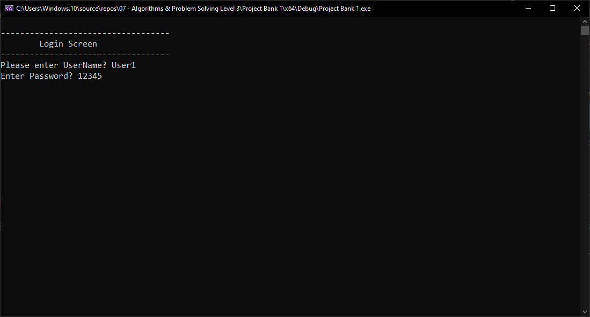

**Access Denied**
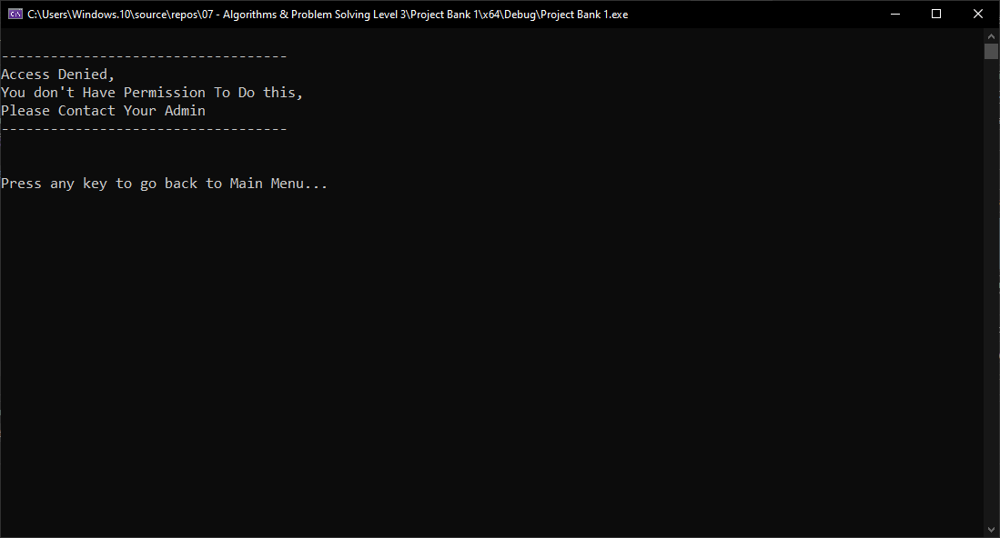

**Main Menu**
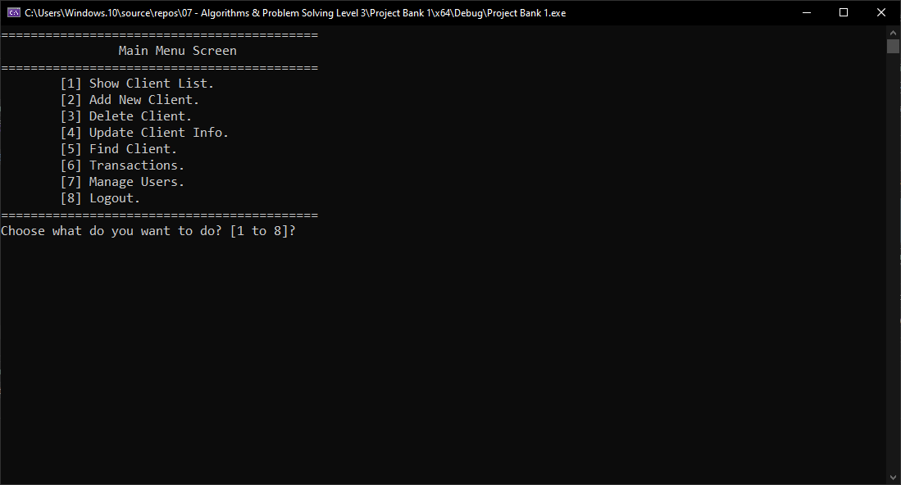

**Manage Users Menu**
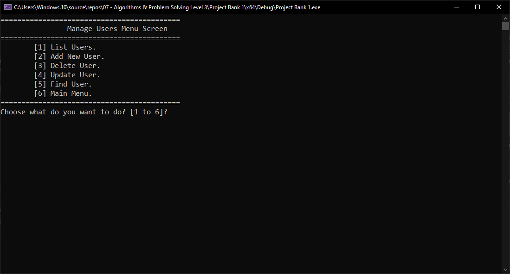

**Adding a New User (Permission Assignment)**
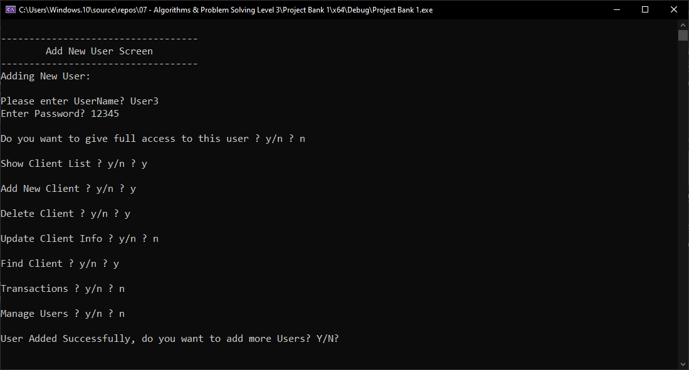

**User List**
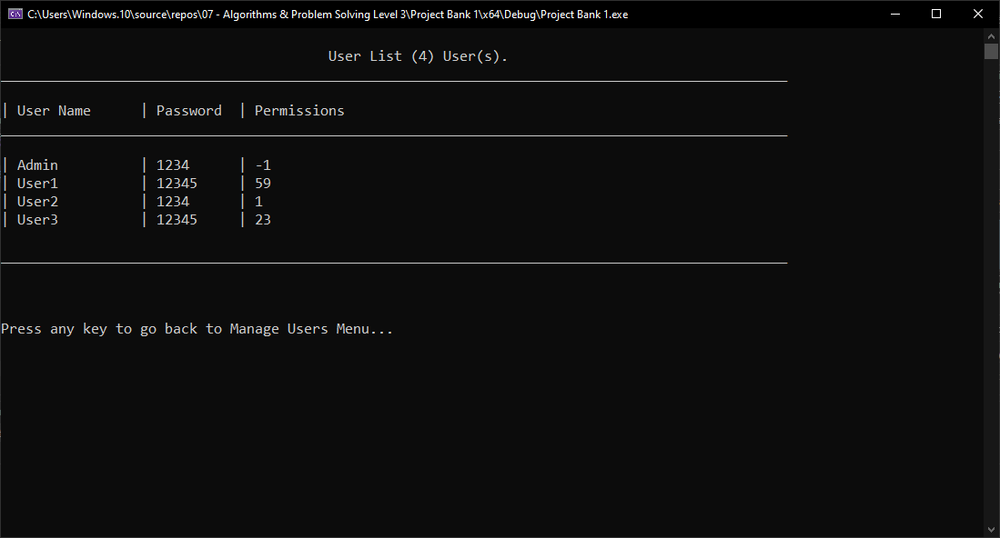

**Client List**
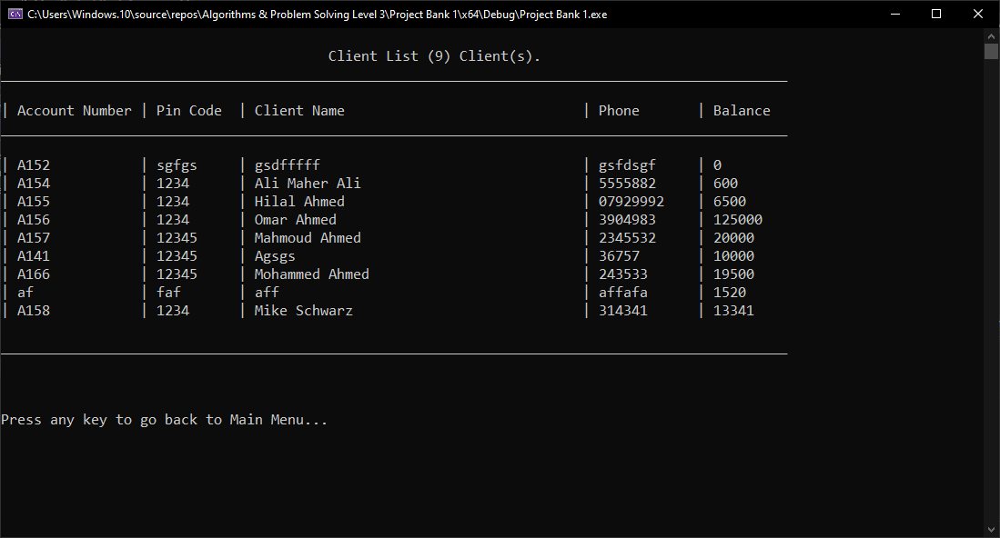

**Adding a New Client**
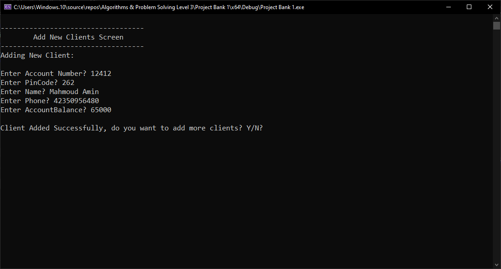

**Deposit Flow (Account Lookup + Transaction)**
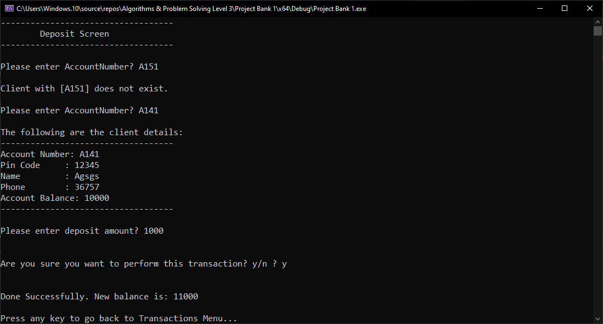

**Withdraw with Balance Validation**
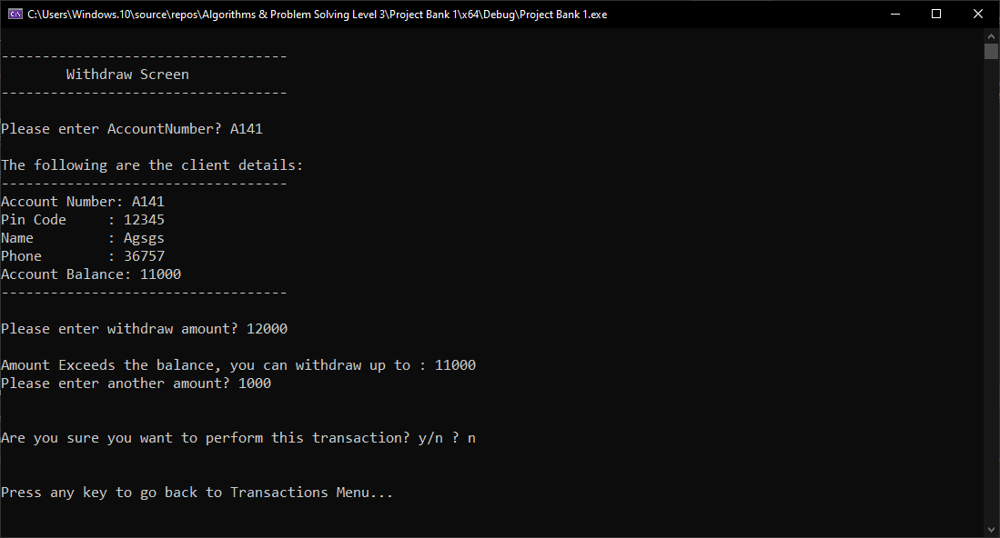

**Total Balances Report**
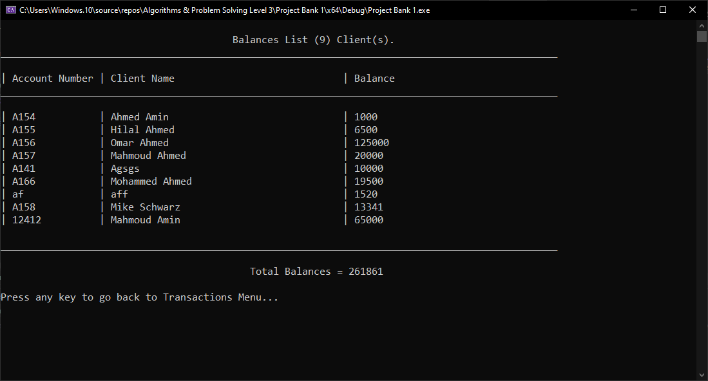

## Known limitations

- Passwords are stored in plain text in `Users.txt` — this is a console
  exercise, not a production system, and that file is git-ignored for
  that reason
- No encryption or security around PIN codes or balances either
- The delimiter-based file format (`#//#`) would break if a field ever
  contained that exact sequence
- Menu navigation uses recursive function calls rather than a loop

## Build

Open `Project Bank 1.sln` in Visual Studio and build/run, or compile
`Project Bank 1.cpp` directly with any C++11-compatible compiler.
